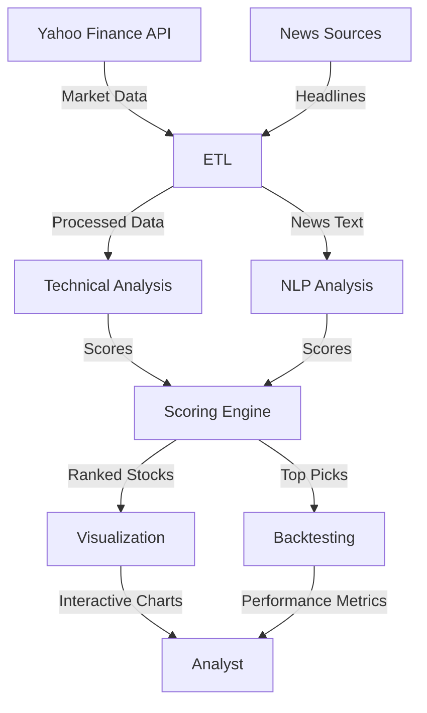

# Quantamental Trading Screener

A sophisticated multi-factor equity screener that combines technical analysis with NLP sentiment analysis to identify high-potential trading opportunities.


## 📊 Overview

This project implements a comprehensive quantamental (quantitative + fundamental) approach to stock screening by blending traditional technical indicators with modern natural language processing techniques. The system analyzes multiple factors including momentum, sentiment, volume, and volatility to generate ranked stock recommendations.

## 🚀 Features

### Core Capabilities
- **Multi-Factor Scoring System** - Combines 4 key dimensions of stock analysis
- **Real-time Data Integration** - Fetches live market data and news feeds
- **Advanced NLP Sentiment Analysis** - Uses ensemble of FinBERT, VADER, and TextBlob
- **Comprehensive Technical Analysis** - RSI, MACD, Bollinger Bands, moving averages, and more
- **Interactive Visualization Dashboard** - Plotly-based charts and analytics
- **Backtesting Engine** - Historical performance validation with benchmark comparison

### Technical Indicators
- **Momentum**: RSI, MACD, Stochastic RSI, ADX
- **Trend**: SMA, EMA, Moving Average Crossovers
- **Volatility**: Bollinger Bands, ATR, Band Width
- **Volume**: Chaikin Money Flow, Volume Ratios
- **Sentiment**: News headline analysis with composite scoring

## 🏗️ System Architecture



## 📦 Installation

### Prerequisites
- Python 3.7 or higher
- pip package manager

### Quick Start
```bash
# Clone the repository
git clone https://github.com/akshayaa-403/quantamental-screener.git
cd quantamental-screener

# Install dependencies
pip install -r requirements.txt

# Run the screener
python main.py
```

### Manual Installation
```bash
pip install yfinance ta transformers torch plotly kaleido 
pip install requests beautifulsoup4 textblob vaderSentiment
```

## 📊 Sample Output

### Top Stock Recommendations
| Rank | Ticker | Composite Score | Momentum | Sentiment | Sector |
|------|--------|-----------------|----------|-----------|--------|
| 1 | AAPL | 0.87 | 0.92 | 0.85 | Technology |
| 2 | MSFT | 0.82 | 0.88 | 0.79 | Technology |
| 3 | NVDA | 0.79 | 0.95 | 0.68 | Semiconductors |

### Dashboard Components
- **Score Distribution** - Histogram of composite scores across universe
- **Sector Breakdown** - Pie chart showing sector representation
- **Factor Correlation** - Heatmap of factor relationships
- **Top Stocks Chart** - Horizontal bar chart of highest-ranked stocks
- **Individual Stock Analysis** - Detailed technical charts for top picks

## 🔧 Configuration

The screener can be customized through the `Config` class:

```python
# Key configuration options
config = Config(
    UNIVERSE_SIZE=50,           # Number of stocks to analyze
    MIN_MARKET_CAP=5e9,         # $5B minimum market cap
    MOMENTUM_WEIGHT=0.4,        # Technical momentum importance
    SENTIMENT_WEIGHT=0.3,       # News sentiment importance
    BACKTEST_PERIOD="1y",       # Backtesting time horizon
    TOP_N_STOCKS=10             # Number of top picks to return
)
```

## 📈 Methodology

### Scoring Algorithm
The composite score is calculated using weighted factors:

```
Composite Score = (Momentum × 0.4) + (Sentiment × 0.3) + (Volume × 0.2) + (Volatility × 0.1)
```

### Sentiment Analysis
- **FinBERT**: Financial-domain specific BERT model
- **VADER**: Rule-based sentiment analysis
- **TextBlob**: Traditional NLP sentiment
- **Ensemble Approach**: Combined scoring for robustness

## 📄 License

This project is licensed under the MIT License - see the [LICENSE](LICENSE) file for details.
